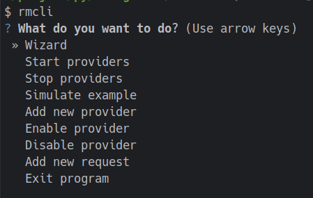

# Request Manager
**note** this is an assignment  
## Overview

The Request Manager is a system designed to handle incoming requests and efficiently distribute them to a ordered queue of providers.
Each provider has its own rate limit, and the system ensures that requests are sent to providers based on their availability and priority.

## Features

- **Dynamic Request Handling:** requests are processed in real-time and dispatched to available providers while respecting rate limits.

- **Request Priority:** Requests can have priorities assigned to them. Higher-priority requests are processed before lower-priority ones.

- **Provider Enable/Disable:** Providers can be toggled on and off, allowing fine-grained control over their availability.

- **Scheduled Execution:** Requests can have an execution time (valid-after time) associated with them, ensuring they are processed at or after the specified time.
- **CLI:** Implement an easy-to-use CLI for add provider, reqeust, start/stop providers

## Usage

To use the Outgoing Request Manager in your project, follow these steps:

1. **Configuration:** Configure the number of providers and their respective rate limits according to your needs.

2. **Initialize Providers:** Create Provider instances with their names and rate limits.

3. **Generating Requests:** Whenever a request needs to be sent to a third-party provider, create a Request object and submit it to the manager.

4. **Running the Manager:** Start the manager, which will process incoming requests and distribute them to providers.
## How to use
### install 
setup your environment
```bash
virtualenv .venv
```
activate it 
```bash
source ./venv/bin/activate
```
install package from git
```bash
  pip install  git+https://github.com/vahidtwo/minimal_request_manager.git 
```
### code example 
```python
import asyncio
from request_manager import Provider
from request_manager import Controller
from request_manager.log import logger
import logging

# Create and configure providers
async def main():
    provider1 = Provider("P1", 0.2)
    provider2 = Provider("P2", 0.1)

    # Create the manager
    controller = Controller([provider1, provider2])
    # Create requests with priority and execution times 
    # this will add to a priority queue 
    controller.new_request_received(
        request_name=f"long request execution time",
        provider=provider1,
        priority=0,
        execution_after=3,
    )
    
    controller.new_request_received(
        request_name=f"long request execution time",
        provider=provider2,
        priority=10,
        execution_after=3,
    )
    controller.start()
    await controller.wait_for_complete()  # wait for all request has been sent


if __name__ == "__main__":
    logger.setLevel(logging.INFO)

    asyncio.run(main())

```
### CLI 
for use cli you can run `rmcli` in your terminal


#### Available commands 
- Wizard: a wizard to create producer and reqeust without any writing code and simulate the reqeust management  
- Start providers: start providers to send requests 
- Stop providers: stop providers from sending requests
- Simulate example: run a simple simulation
- Add new provider: add new provider to system
- Enable provider: enable a provider
- Disable provider: disable a provider
- Add new request: add new request to a provider
- Exit program: exit

## License
This project is licensed under the MIT License - see the [LICENSE](./LICENSE) file for details.